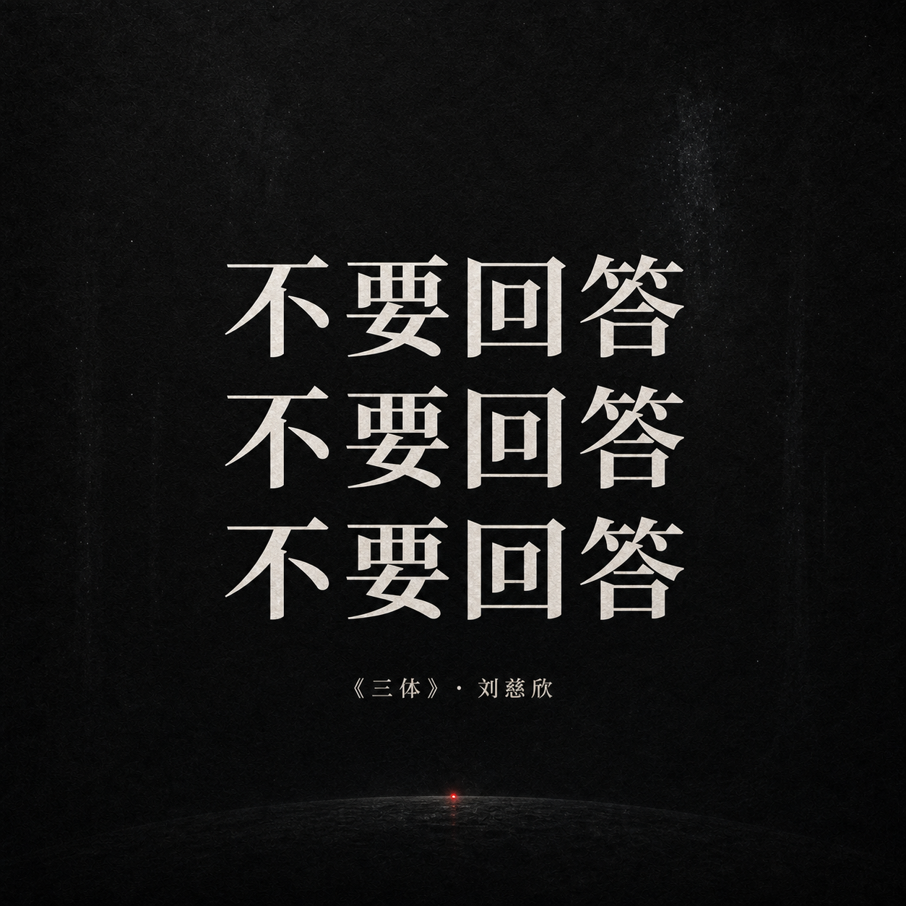

# Quote Cards / 金句卡片

> 生成文学、科幻、观点、哲思类金句卡，并默认要求图像模型直接把中文字生成在最终画面里。

这个 skill 的核心纠偏是 Native Text First：金句卡默认不是“先出空底图再后期叠字”，而是让图像模型直接生成带中文排版的成品图。适合三体、文学摘句、公众号金句、演讲摘录、品牌观点卡。

## 示例图

<p><br><sub>诗意收藏卡：文字是主角，画面只负责让它更值得保存。</sub></p>
<p><br><sub>三体金句卡 1</sub></p>
<p><br><sub>三体金句卡 2</sub></p>
<p><br><sub>三体金句卡 3</sub></p>

## 它能做什么

- 生成方图、竖图、横图金句卡。
- 把中文主句、副句、出处、氛围和视觉隐喻做成一个整体。
- 控制文字长度、对比度、留白、字体感和情绪。
- 只有在用户明确要可编辑模板/后期修复时，才退回外部叠字。

## 安装

把这个仓库克隆到本机 Codex skills 目录：

```bash
mkdir -p ~/.codex/skills
git clone https://github.com/Alexsun1one/quote-cards.git ~/.codex/skills/quote-cards
```

如果你的 Agent 使用其它 skills 目录，也可以把包含 `SKILL.md` 的这个仓库复制过去。

## 怎么用

示例请求：

```text
用 quote-cards 生成 3 张《三体》中文金句卡。要求文字原生生成在图里，不要先做空底图再后期叠字。
```

Skill 入口是 [`SKILL.md`](SKILL.md)。细则在 [`references/`](references/)；如果这个仓库带脚本，脚本在 [`scripts/`](scripts/)。

## 质量要求

- 先服务内容，再服务风格；图必须解释一个具体想法。
- 中文默认要可读，标题、caption、标签不能只当装饰纹理。
- 同一组图要风格统一，但每张图要贴合自己的段落/用途。
- 示例图是工作流参考，不是唯一模板。

## 公众号

更完整的拆解、提示词、案例复盘、AI 写作和产品实践，我会继续写在公众号里。下面是我的真实公众号二维码/搜一搜卡片，不是仿造的装饰二维码。

<p align="center">
  
</p>

## 开源协议

MIT。见 [`LICENSE`](LICENSE)。

## 声明

这是 Sun Wuyuan / Alexsun1one 的原创开源 Skill 包。它不隶属于 OpenAI、GitHub、微信或任何被提及的平台。请不要用它去复制受保护 IP、仿冒在世艺术家，或暗示不存在的品牌背书。
